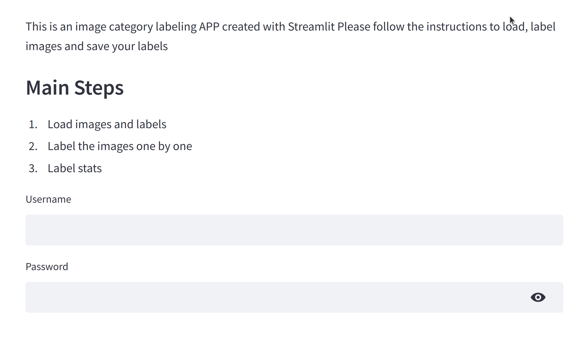
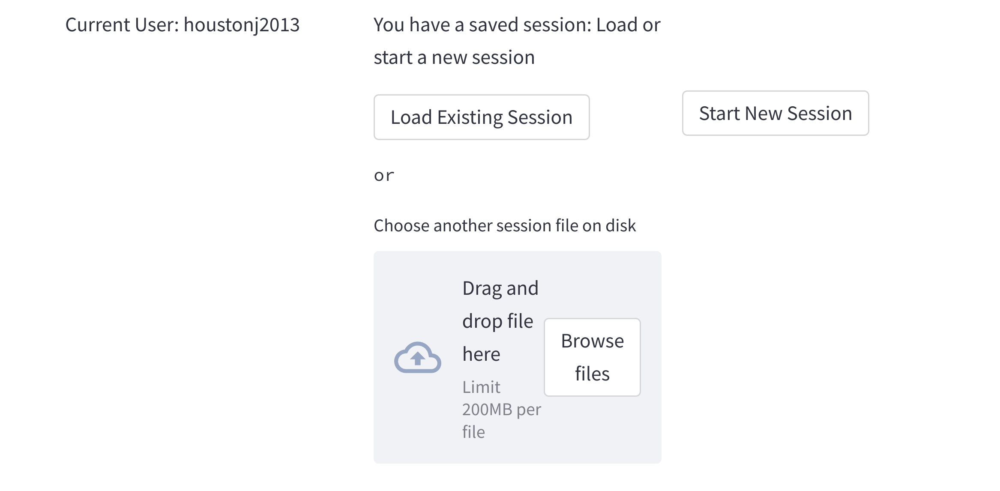
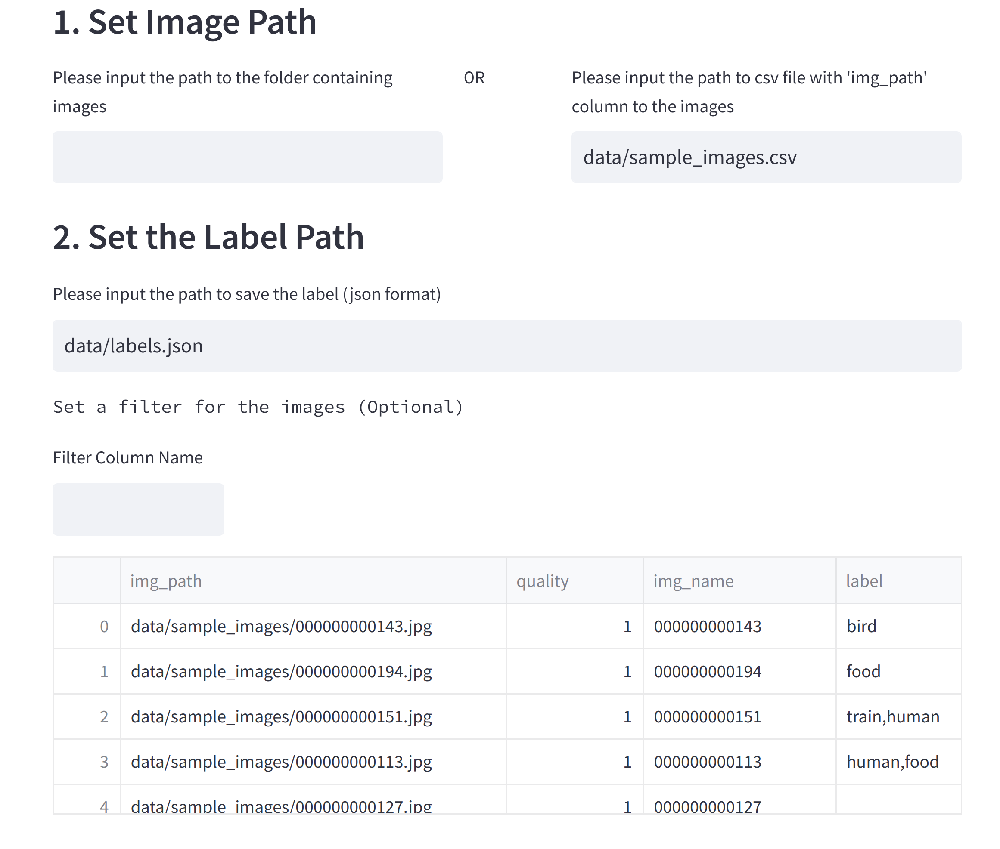
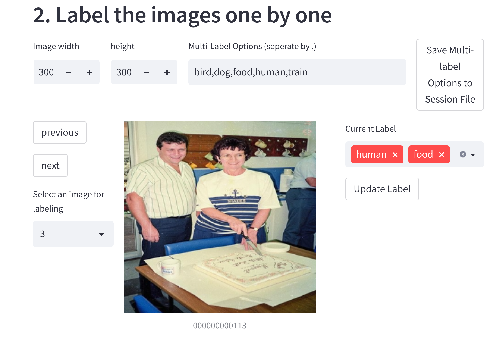
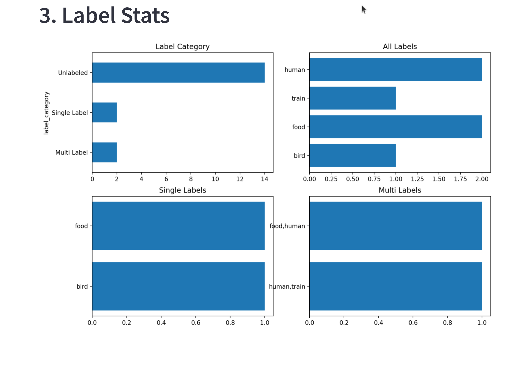

# streamlit_image_labeling
Recent advances in self-supervised learning has enabled the possibilities of building robust deep learning models with much fewer human labels. The number of required labels could be only 1% of the number required by the supervised version. The quality of the labels matters in this case. A quick labeling tool is built here for data scientist to review, modify and label the small amount of images. The tool is good for the internal use of a small team and not for enterprise. The sticky session and username and password are managed in a local folder ".streamlit/". You need to create the folder and add your username and password following the [streamlit instruction](https://docs.streamlit.io/knowledge-base/deploy/authentication-without-sso) option2/step1.


## multilabel_image_labeling

multilabel app for image annotation. You need to install the required packages in your conda environment before use. After clone the repo and create a new conda environment, install the required packages. 
```
pip install -r requirements.txt
```
Then create a local folder ".streamlit/" if the folder doesn't exist. Set up the username and password. 
```
streamlit run streamlit_image_labeling/multilabel_image_labeling.py 
```
Login with your username and password



Load existing session associated with your username, or load another session from file, or create a new session. 



Specify the paths to the image files using the folder path or a csv file. Specify the file to save the label in json format. 



Navigate the images using the button on the left panel and label the images using the multiselect button on the right panel. Click "update label" button to save the label. 



Review some statistics of the labels. 



